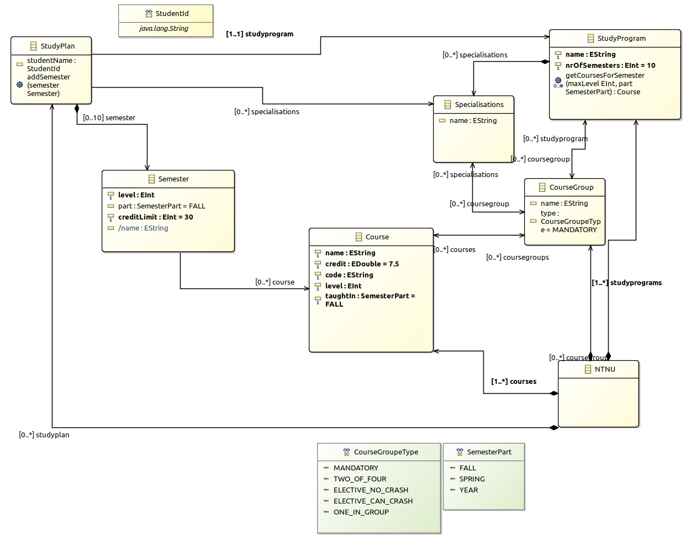

# Info

## Datamodel

To generate the model Sirius class diagram has been used.

Both study programs and study plans is a part of the model.

Study programs

- A study program with its course groups defines which courses it is possible to choose in a program.
- A Spesialization contains course groups which is spesial for that spesialization.
- A course group contains the courses available for the study program/spesialization and the type is defined in CourseGroupType.
- A course is part of one or many course groups, level defines when a student have the knowledge to take the course, and taughtIn defines what part of the year its taught. A 2. year student can attend a 1. year course, this is why the courses isn't a part of a semester in the study programs part of the model.
- NTNU is just a container object

Study plan

- When a student creates a student plan, he/she have to choose a study program and specialisations. When this is done, the student can start to plan a semester.
- When a semester is created, the study program part of the data model defines which courses it is possible to choose. By calling the function StudyProgram.getCoursesForSemester the student will receive a list of courses he/she can attend.

# Repo structure

- studyprogramsmodel/model - contains models for generation of code
- studyprogramsmodel/model/NTNU.xmi - Instance data
- studyprogramsmodel/model/studyprograms.aird - Model - opens with Sirius
- studyprogramsmodel/model/studyprograms.ecore - ecore model - not possible to open because Sirius is used
- studyprogramsmodel/src - contains the auto generated code
- studyprogramsmodel.tests/src - unit tests

# Implemeted Ecore features

## Operations

- StudyProgramImpl: getCoursesForSemesters(Eint maxLevel, SemesterPart part)
- StudyPlanImpl: addSemester(Semester semester)

## Derived feature

- Semester.name

## OCL constraint

- StudyPlan: nrOfSemestersIsOk

## Manual written validation

- StudyprogramsValidator: validateSemester_taughtAtTheRigthTimeOfTheYear
- StudyprogramsValidator: validateSemester_coursesHasRightLevel

## Datatype with constraint

- StudentId

## Unit tests

- All ecore requested unit test are implemented
