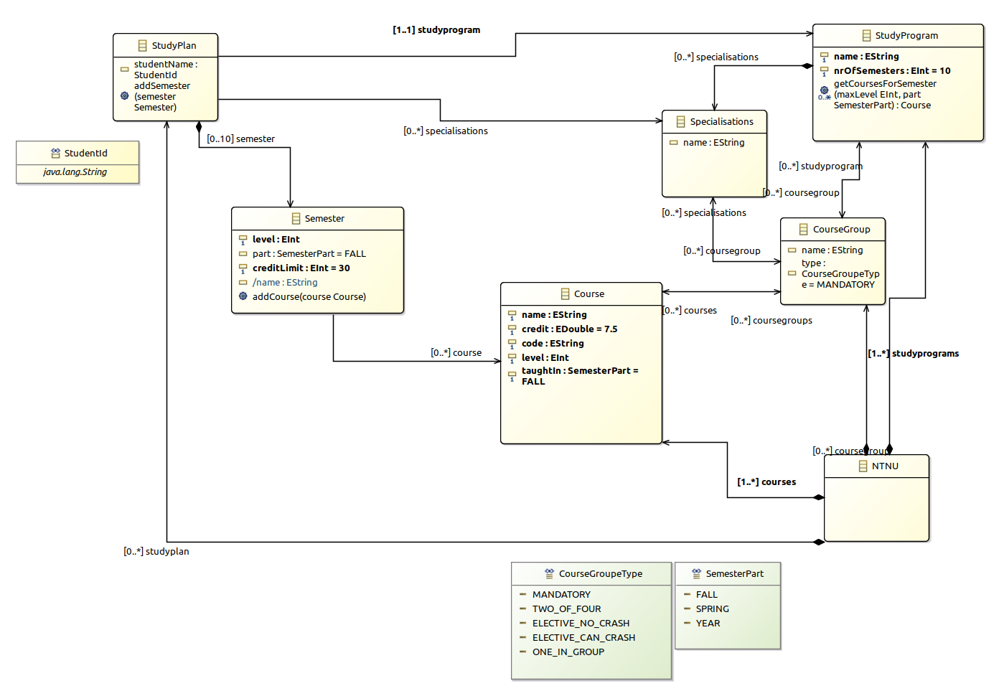

# Assignment 2

## Changes from assignment 1 to 2

- StudyProgram: `getCoursesForSemester(maxLevel, part)` is changed to two methods: `getCoursesForSemester(level, part, groupType)` and `getCoursesForSemesterBySpecialization(level, part, specialization, groupType)` this is to be able to fetch courses more specific to how the view looks like.
- Some renaming

## Produced HTML

Open the file by clicking [here](./studyprograms.model/src/studyprograms/toHtml/ExampleInstances.html) or open `./studyprograms.model/src/studyprograms/toHtml/ExampleInstances.html`

## Run model transformation

The `xmi` model used in the transformation is `./studyprograms.model/src/studyprograms.model/example/ExampleInstaces.xmi`

1. Add `./external-jars/jsoup-1.13.1.jar` to the project: `Project->Properties->Java Build Path->Libraries->Add External JARs`
2. Run the model transformation by running the `main()` method in this file: `./studyprograms.model/src/studyprograms/toHtml/ToHmtlParser.java`

# Assignment 1

## Datamodel

To generate the model Sirius class diagram has been used.

Both study programs and study plans is a part of the model.

Study programs

- A study program with its course groups defines which courses it is possible to choose in a program.
- A Specialization contains course groups which is special for that specialization.
- A course group contains the courses available for the study program/specialization and the type is defined in `CourseGroupType`.
- A course is part of one or many course groups, `level` defines when a student have the knowledge to take the course, and `taughtIn` defines what part of the year its taught. A 2. year student can attend a 1. year course, this is why the courses isn't a part of a semester in the study programs part of the model.
- NTNU is just a container object

Study plan

- When a student creates a student plan, he/she have to choose a study program and specializations. When this is done, the student can start to plan a semester.
- When a semester is created, the study program part of the data model defines which courses it is possible to choose. By calling the function `StudyProgram.getCoursesForSemester()` the student will receive a list of courses he/she can attend.

## Repo structure

- studyprograms.model/model - contains models for generation of code
- studyprograms.model/model/NTNU.xmi - Instance data
- studyprograms.model/model/studyprograms.aird - Model - opens with Sirius
- studyprograms.model/model/studyprograms.ecore - ecore model - not possible to open because Sirius is used
- studyprograms.model/src - contains the auto generated code
- studyprograms.model.tests/src - unit tests

## Implemeted Ecore features

- To demonstrate different aspects EMF/ecore, some functionality is implemented twice, with different methods.

### Operations

- StudyProgramImpl: getCoursesForSemesters(Eint maxLevel, SemesterPart part)
- StudyPlanImpl: addSemester(Semester semester) - Validates the adding
- SemesterImpl: addCourse(Course course) - Validates the adding

### Derived feature

- Semester.name

### OCL constraint

- StudyPlan: nrOfSemestersIsOk

### Manual written validation

- StudyprogramsValidator: validateSemester_taughtAtTheRigthTimeOfTheYear
- StudyprogramsValidator: validateSemester_coursesHasRightLevel

### Datatype with constraint

- StudentId

### Unit tests

- All ecore requested unit test are implemented
- Test for manually written validators added in studyprograms.tests/StudyprogramsValidatorTest.java
